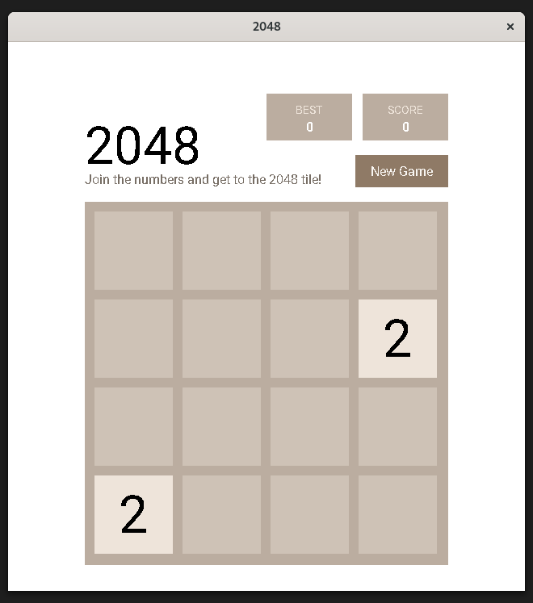
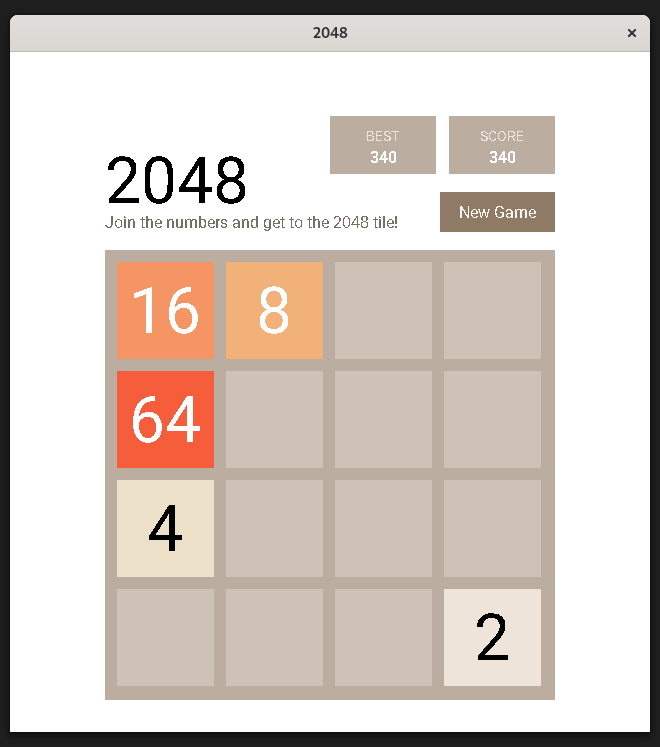
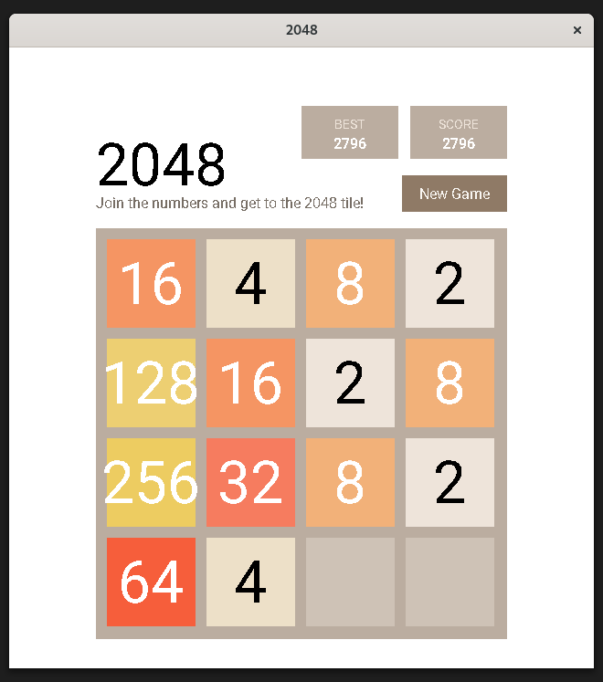

# 2048 Game Clone

A C implementation of the classic 2048 sliding tile puzzle game.

## Requirements and Dependencies

The game is based on my custom framework that itself is based on the `SDL2`, `SDL2_image`, `SDL2_TTF`, and `libconfig` libraries.  
The game specifically uses `sqlite3` to keep the score, so make sure to install all the dependencies before running the project.

## Screenshots

